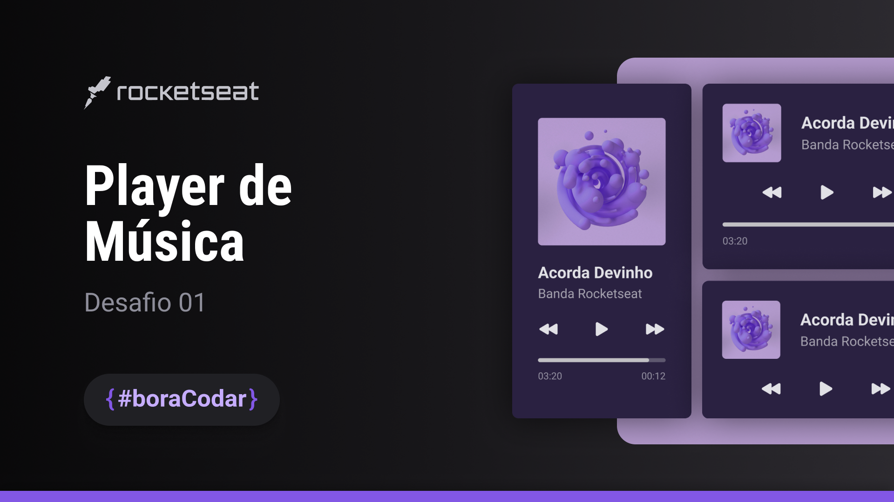

# DESAFIO 01 - PLAYERMUSIC 
## Rocketseat #boraCodar 
<h1>
  

)

This project is a music player website

## Links

**Figma do projeto** [Player Music](https://www.figma.com/community/file/1195050524500542670)

## Sobre o Projeto
O player de música é um componente para tocar áudio. Podendo ser utilizado em aplicação web e mobile.   
